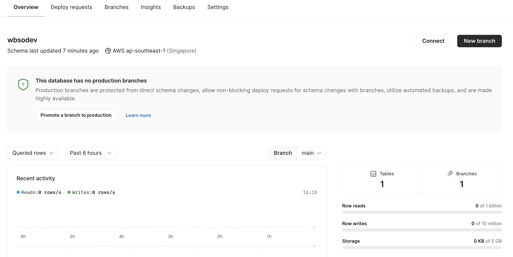
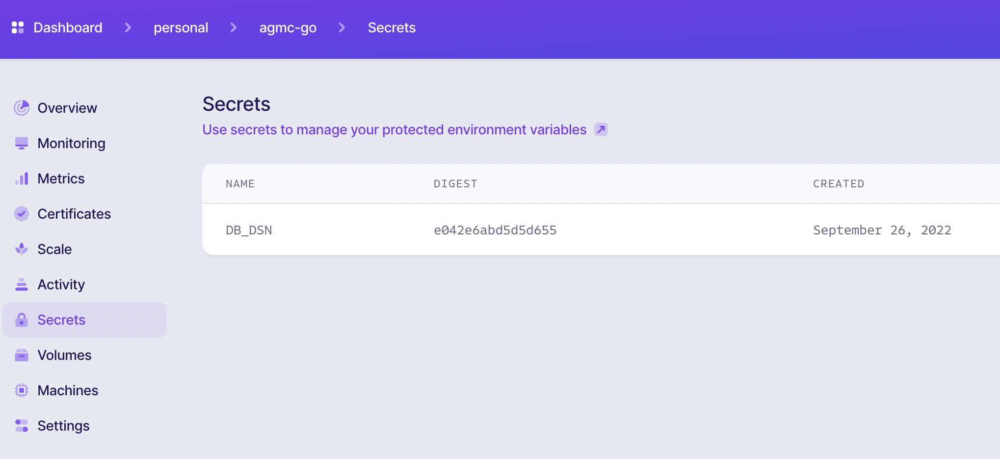
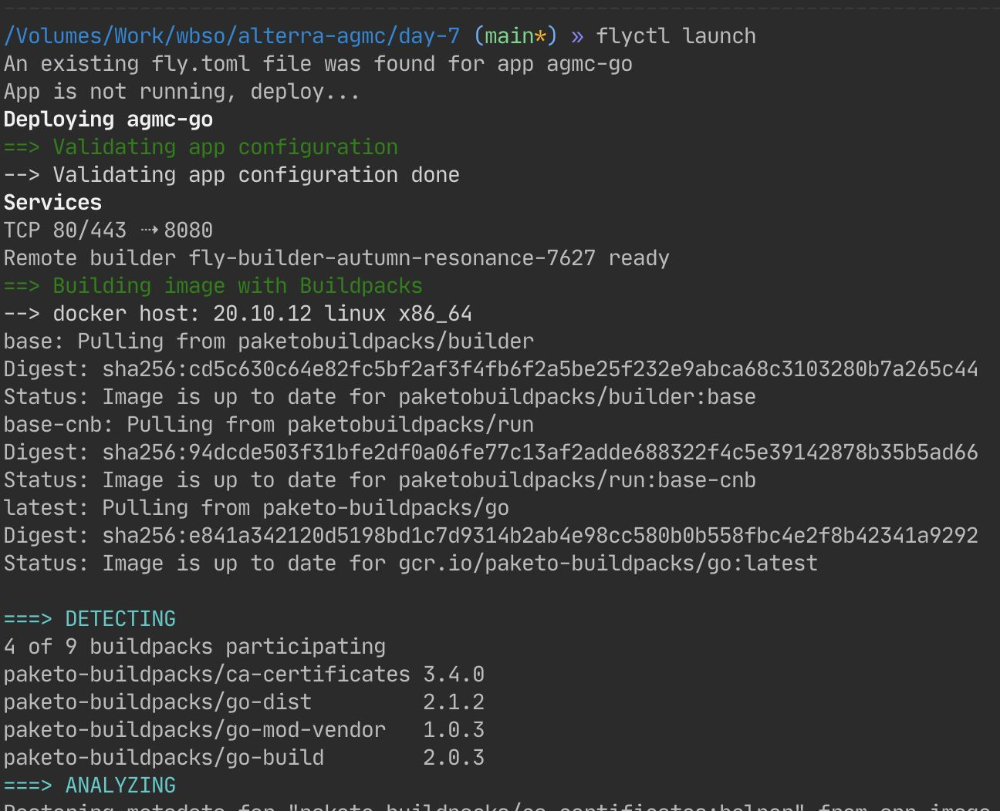
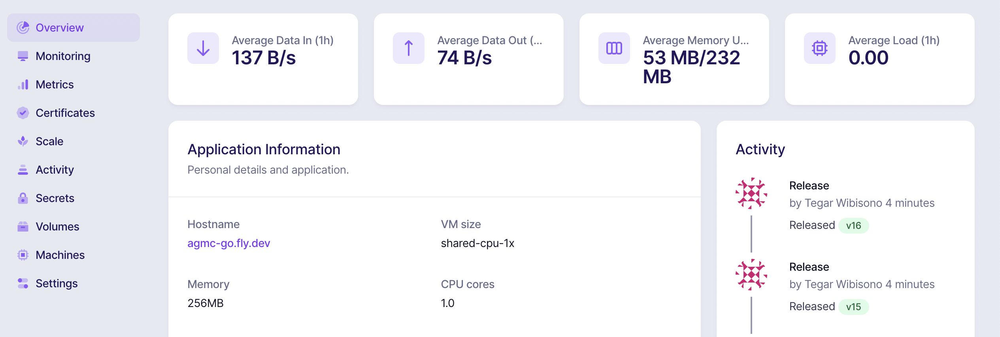
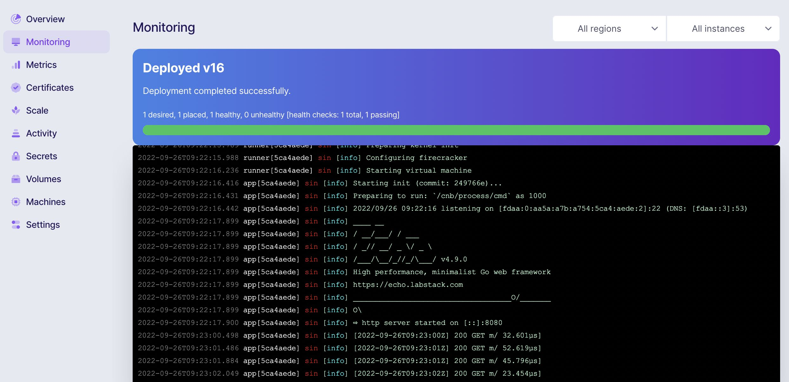
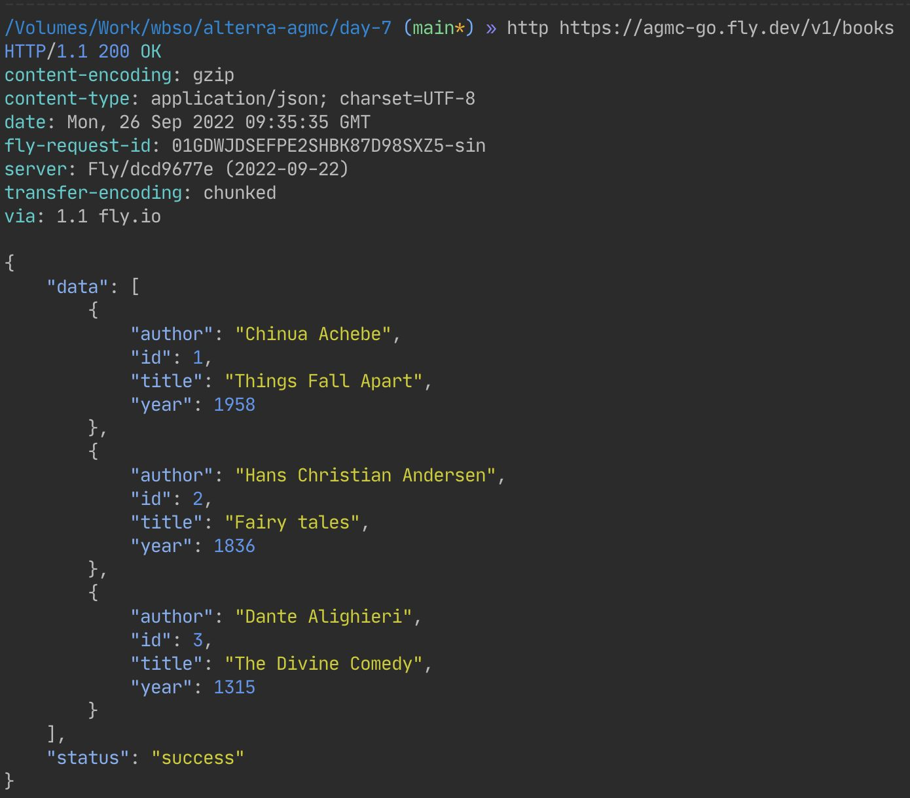

# Deploy Project from day 7 to Fly.io

> app url: https://agmc-go.fly.dev/

## 1. Create Database in planetscale

## 2. Set secret variable on fly.io

## 3. Deploy

1. run `flyctl launch` command
   

2. monitor app from fly control panel
   
   

3. Verify deployed app
   
